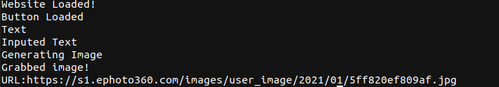

<h1 align="center">Welcome to Project AimeijiTextGen</h1>
AimejiTextGen is a very basic web scraping mechanism to generate text effect image and get the url of the generated image.

## Sample

 

  </a>
    
  </a>
  
  

## 📝 Prerequisites

- git
- npm >=2.0.32
- node >=12.18.3

## 🔍 Installation

* [Puppeteer](https://www.npmjs.com/package/puppeteer)
To install Puppeteer, simply open terminal and type npm i puppeteer

## Author

👤 **Somnath Das**

* Instagram: [@samurai3247](https://www.instagram.com/samurai3247/)
* Twitter: [@aksd3247](https://twitter.com/aksd3247)
* Github: [@SomnathDas](https://github.com/SomnathDas)

## 🤝 Contributing

Contributions, issues and feature requests are welcome!  

## Show your support

Give a ⭐️ if this project helped you!
